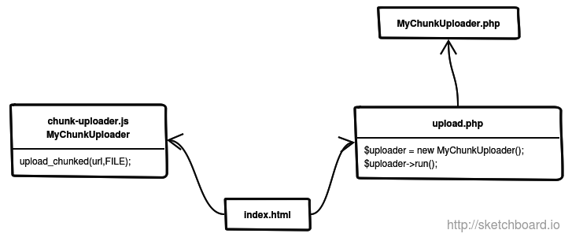

MyChunkUploader - AJAX chunked file uploader
===============
This allows one to implement a chunked file uploader functionality with the aids of JavaScript class on the client/browser side and a PHP class on the server side.
It is especially useful when you want to overcome the [upload_max_filesize](http://php.net/manual/en/ini.core.php#ini.upload-max-filesize) | [post_max_size](http://php.net/manual/en/ini.core.php#ini.post-max-size) php.ini restriction.

HOW IT WORKS
============

To implement this functionality is straightforward:
- your main `index.html` file initializes a MyChunkUploader JavaScript object (see `chunk-uploader.js`) which you'll use it to start sending your file to the remote server. To do that you call the method upload_chunked ('/upload.php',FILE). This call splits the file into multiple chunks and sends them via a series of Ajax POST requests to the `upload.php` PHP script.
- the `upload.php` is merly a dispatcher (however, this is where you can inject your own logic before the server accepting the client requests); it receives the previous POST requests and forwards them to a MyChunkUploader PHP instance (see `MyChunkUploader.php`)
- the MyChunkUploader PHP instance saves each chunk to a temporary file; when all chunks are received the temporary/chunked files are concatenated resulting the final uploaded file which will be stored on a preset folder on the web server.

REQUIREMENTS
============

- front-end : IE10+, FF13+, Chrome10+, Opera12+
- back-end  : PHP 5.3+, a web server with PHP support

MyChunkUploader JavaScript class
================================

This JavaScripts class (actually a function) allows you to split a client-side FILE into multiple chunks and to send these chunks asynchronously (thanks to AJAX) to your server PHP backend. The class is flexible, provides real-time feedback and progress.

### function MyChunkUploader(class_signature)
The `class_signature` argument is used to prefix the following custom header names:
- *Type* : a header used to specify the file content-type
- *Security-Nonce* : a header used to specify the client security nonce
- *Raw-Post* : a header used to specify if the chunk is sent within a JSON object or as a raw binary data
- *Abort* : a header used to specify that the client requested to abort the whole process
- *Timeout* : a header used to specify the upload maximum allowed time

When the `class_signature` is not provided then `X-MyChunkUploader` is assumed by default.

### Properties
`options` a JSON object with the following properties:
- *max_chunk_size* : the size in bytes of a chunk (default to *1048576* bytes)
- *raw_post* : when true the client will send the chunk as a raw binary data, otherwise the data will be encapsulated within a JSON object
- *send_interval* : the number of milliseconds to wait before creating and sending the next available chunk
- *max_parallel_chunks* : the number of chunks that may be created/sent at a time (the more parallel chunks are sent the more resources are used by the client/server systems)

### Events
The following events allow you to control the file progress and/or the upload state:
- `on_chunk_start (object)` : this function is called right after a new chunk is created. The JSON *object* contains the following arguments:
  - *index* : the index number assigned to the current started chunk
  - *range* : a JSON object having the following attributes:
    * *from* : the chunk start position
    * *to* : the chunk end position
- `on_upload_progress (object)` : this function is called while the file chunk is uploading. The JSON *object* contains the following arguments:
  * *sent* : the number of bytes sent so far
  * *total* : the total number of bytes of the file
  * *percentage* : the percentage of what is already sent
  * *elapsed* : the current elapsed time in seconds
  * *eta* : the remaining seconds to finish

  **NOTE**: you may use the `Number.toHMS()` prototype to format the seconds as *HH:mm:ss*
  
- `on_ready (object)` : this function is called once a chunk was successfully sent. The JSON *object* contains the following arguments:
  * *sent* : the number of bytes sent so far
  * *total* : the total number of bytes of the file
  * *elapsed* : the current elapsed time in seconds
  * *file* : the JS file object
- `on_error (XHR,object,type)` : this function is called in case of a AJAX/HTTP error. *XHR* is the XMLHttpRequest object used for the current request. The *type* is a string specifying the error type (normally *server*). The JSON *object* contains the following arguments:
  * *success* : false
  * *json* : a JSON object containing among other properties the *name* which is the file name. Other properties might be *message* and *code* containing the error message and the error code.
- `on_abort (XHR, object)` : this function is called after the `abort()` function was successfully acknowledged by the server. The *XHR* is a reference to the current XMLHttpRequest instance. The JSON *object* contains the following arguments:
  * *success* : false
  * *message* : *Aborted by user*
  * *code* : *UI*
- `on_done (XHR,start_time)` : this function is called when all the chunks were sent and the file is completely uploaded to the server. *XHR* is the XMLHttpRequest object used for the current request. The *start_time* is the timestamp (in milliseconds) when the upload was started.

### Methods

The following methods may be used to upload a file to the server:
- `upload_chunked (url, file, nonce, params)` : call this function to start uploading a file to the server. The *url* parameter is the absolute|relative URL to the `upload.php` script. The *file* is the JS file object to be uploaded. Optionally you may send also a security nonce within the *nonce* argument. The MyChunkUploader PHP class implements a callback that allows you to validate the security nonce at the server level. The JSON *params* argument may contain any other parameters that you want to send to server.
- `abort (params)` : call this function to tell the server application that the upload is going to be aborted, thus to do its clean-up (remove all temporary uploaded chunks). The JSON *params* argument may contain any other parameters that you want to send to server.
  **params example**: For instance when I use this class in a WordPress plug-in I usually encapsulate the *action* and the *nonce* arguments within it. Please note that *params* is used only when `options.raw_post` = *false*.
